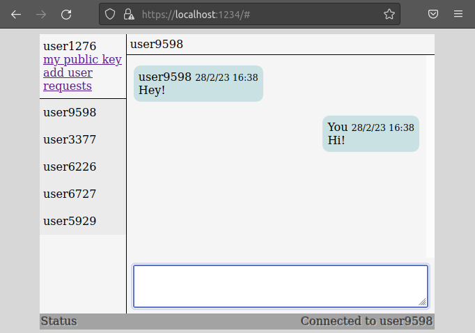

# chat_webrtc

This is a decentralized peer-to-peer messaging app, that utilizes the webrtc datachannels.

Running the app for the first time will generate an ECDH public/private key pair. The public key is used as an id to establish connections between the users. The users exchange their connection information through trackers (signaling servers), in a end-to-end encrypted manner using a common derived key. After the information is exchanged, a direct connection between the peers is established. Users can also chat with users that are connected to different trackers.

